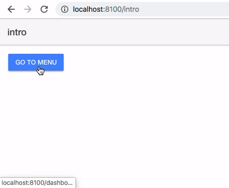

# ionic4-menu-tabs-example

## Install the Ionic CLI ##
Before proceeding, make sure the latest version of Node.js and npm are installed. See Environment Setup for details. Install the Ionic CLI globally with npm:

`npm install -g ionic`

For more information see https://ionicframework.com/docs/

## Start this example ##
1. Install all dependencies `npm install`
2. Run Ionic `ionic serve`
3. npm rebuild node-sass //if got error
2. Run Ionic `ionic serve`
 
